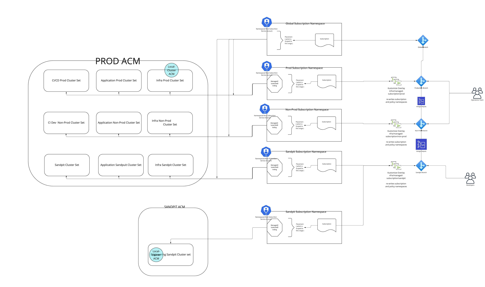

# acm-root-subs
Example GitOps repository for deploying ACM applications and Projects using kustomize to promote between environments / clustersets

This is deployed by first creating the root subscription namesapces, the service accounts and roles and rolebindings etc.  All of this is simply done through an 'oc apply -k ./FIRST_STPES/'.

Then we create the root-subscriptions for each environment using the create-subscriptions.sh - in which we adopt the identity of the service accounts for each environment and then using that identity we create the subscriptions to each managed subscription.

The creation of each subscription uses kustomize to pre-pend the environment names and add them to appropriate environments root namespace.

When creating "config" or "policys" or "applications:" we create them in the managed-subscription folders with no reference to the environment and "all cluster" placements using the sandpit or dev brnaches.  these are then auto applied to those clsuters in the dev and sandput namespaces.

To promote the policy we simpl promote their branch in git and ksutomize handles renaming them and adding them to the higher environments namespaces for application to those higher cluster sets.

